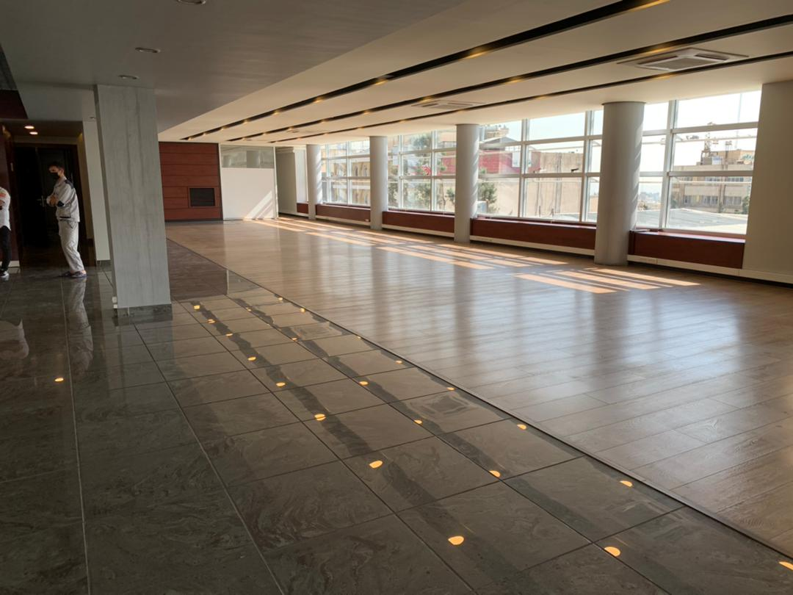

# Jordan-Atefi(Option1)
| **Office_nickname**                                   | Jordan Atefi                                                                                                 |
| ---------------------------------------------------------- | ------------------------------------------------------------------------------------------------------------ |
| **Address**                                            | Jordan -Atefi St.                                                                                            |
| **Google_maps_location_URL**                        | [Link](https://goo.gl/maps/1SMEdfvJEttPHC7V9)                               |
| **Size_in_Sq/m2 (levl1 with 700Sq/m+480Sqm Level2)** | 1180 (Level 1: 650 sq/m of office space and 50 sq/m common area, Level 2: 450 sq/m of office space and 30 sq/m common area)                                                                                                        |
| **Price_per_month:**                                 | $ 26,219.60                                                                                                  |
| **Price_per_annum:**                                 | $ 314,635                                                                                                    |
| **Running_cost_per_m2**                             | $ 1.48                                                                                                       |
| **Total_running_cost_per_month**                   | $ 1,746.40                                                                                                   |
| **Total_running_cost_per_annum**                   | $ 20,956.80                                                                                                  |
| **Floor_number**                                      | Level 1 and level 2                                                                                          |
| **Parking** (Option 1)                                 | 23                                                                                                           |
| **Agent_name**                                        | Ashkan                                                                                                       |
| **Agent_Whatsapp_number**                            | +989121868466                                                                                                |
| **Agent_company**                                     | Self employed                                                                                                |
| **Score**                                              | 8.5                                                                                                            |
| **Score_reason**                                      | Professional landlord who has worked with multinational companies in this building, good space, nice roof garden         |
| **Comments_about_this_office**                      |  1- They want to receive annual rent in the first month of every year   2-Level 1: 650 sq/m of office space and 50 sq/m common area, Level 2: 450 sq/m of office space and 30 sq/m common area   3-Tax is included  4- We can rent 7 more parking, the price will announce later by the landloard  5- The annual rent increase rate will be based on IR central bank inflation rate with cap of 40%   6- The start date of contract will be in 45 days after signing the contract  7- They have no issue for us to instal radio links and cabls   8- Power and telephone  usage cost will be by the company while water and gas cost is included in the running cost   9- The landlord will clear the level 2 and pass it empty to us   10- Good location  11- Professional landlord and multinational tenants  12-Good access to public transportation  13-There is provision for power at the peripheries    14-Both floors have adequte capacity for power and AC  15-One month rent to will paid as security deposit  |
## Images Level1

## Images Level2

## Roof and Building outside view

<video width="560" height="240" controls>
  <source src="./m1.mp4" type="video/mp4">
  Your browser does not support the video tag.
</video> 
<video width="560" height="240" controls>
  <source src="./m2.mp4" type="video/mp4">
  Your browser does not support the video tag.
</video>
<video width="560" height="240" controls>
  <source src="./m3.mp4" type="video/mp4">
  Your browser does not support the video tag.
</video>