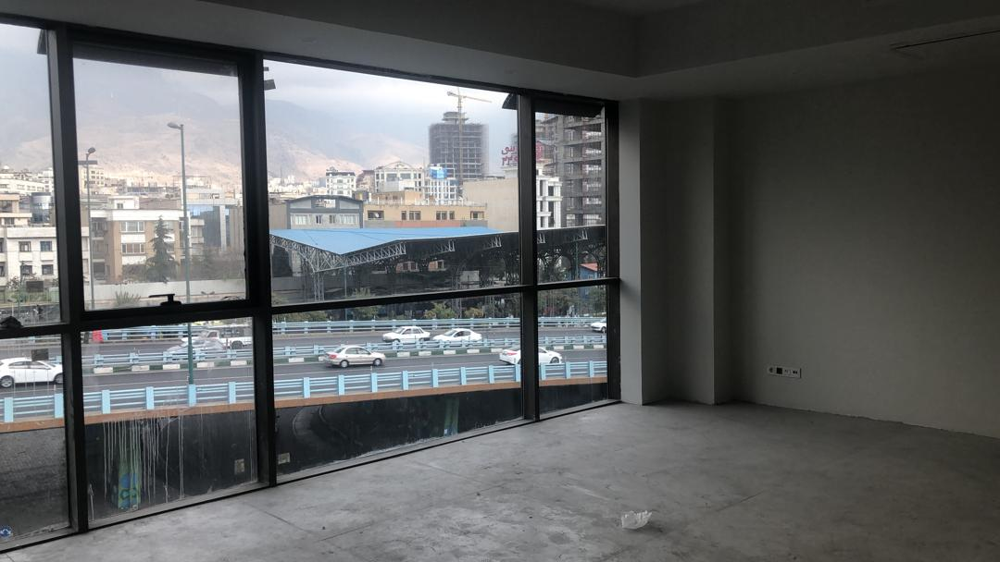
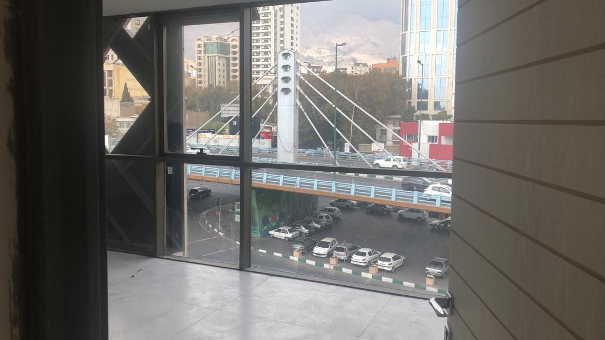

# Parkway
| **Office_nickname**                 | Parkway                                                                                                                                       |
| ---------------------------------------- | --------------------------------------------------------------------------------------------------------------------------------------------- |
| **Address**                          | Parkway, Valiasr St,                                                                                                                          |
| **Google_maps_location_URL**      | [Link](https://goo.gl/maps/bp1Kmjr4tKW9u4Py7)                                                                |
| **Size_in_Sq/m2**                  | 1590                                                                                                                                          |
| **Price_per_month:**               | $  55,944.4                                                                                                                                     |
| **Price_per_annum:**               | $  671,333                                                                                                                                    |
| **Running_cost_per_m2**           | N/A                                                                                                                                           |
| **Total_running_cost_per_month** | N/A                                                                                                                                           |
| **Total_running_cost_per_annum** | N/A                                                                                                                                           |
| **Floor_number**                    | Level 1-3                                                                                                                                     |
| **Parking**                          | 30                                                                                                                                            |
| **Agent_name**                      | Hadian                                                                                                                                        |
| **Agent_Whatsapp_number**          | +989121497041                                                                                                                                 |
| **Agent_company**                   | Nili fereshteh                                                                                                                                |
| **Score**                            | 9                                                                                                                                             |
| **Score_reason**                    | No need to have renovation, Bright atmosphere, Near to taxi station and public transportation, Near to main highways (Chamran, Modares, Sadr) |
| **Comments_about_this_office**    | Seprated in 3 floors, It will be ready in 1 month                                                                                             |

## Images

<video width="560" height="240" controls>
  <source src="./v1.mp4" type="video/mp4">
  Your browser does not support the video tag.
</video> 
<video width="560" height="240" controls>
  <source src="./v2.mp4" type="video/mp4">
  Your browser does not support the video tag.
</video> 

