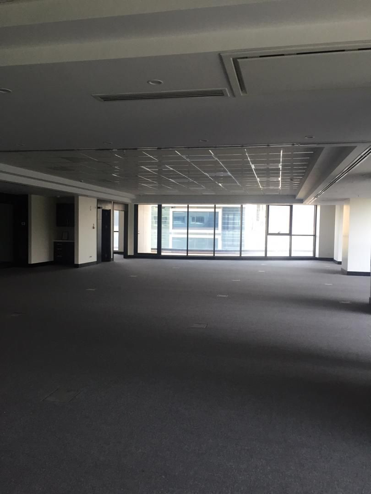
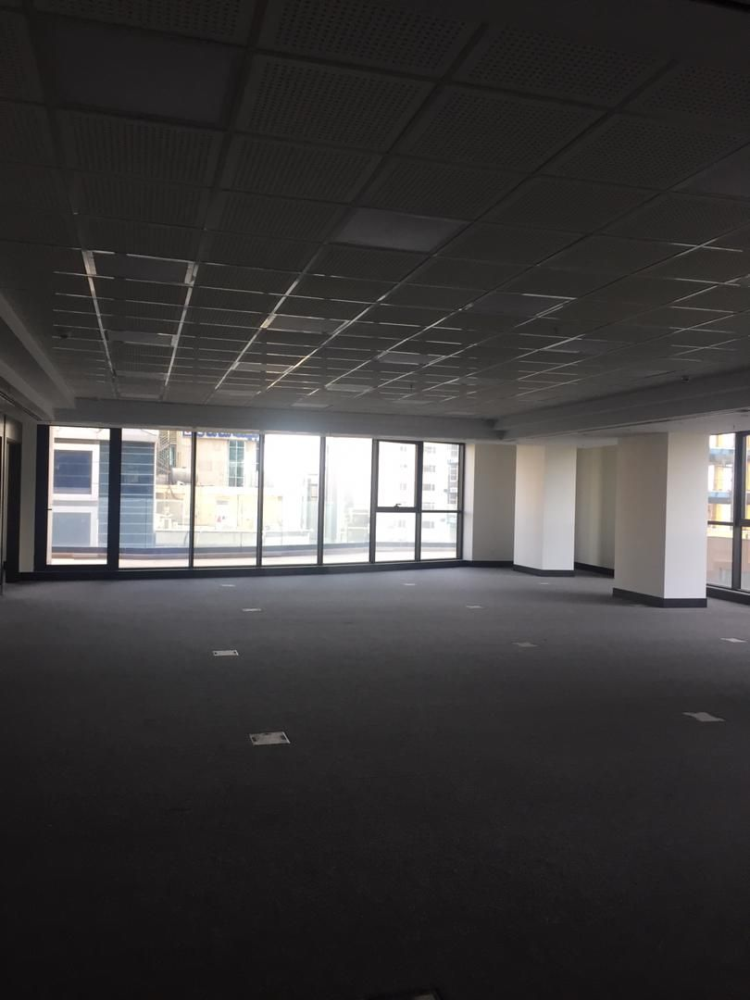
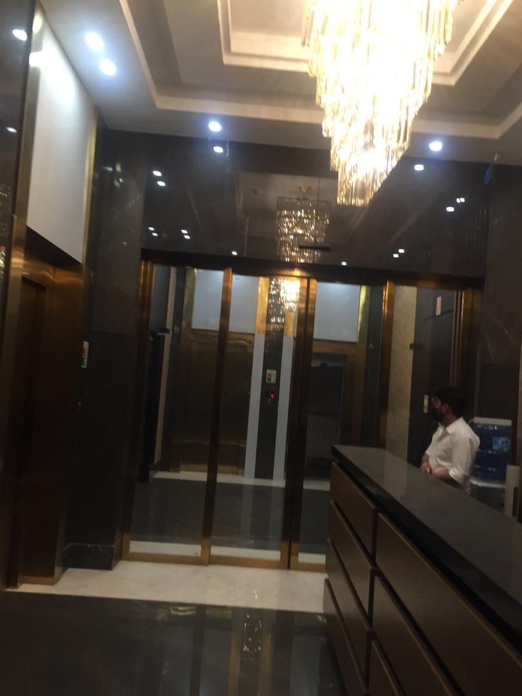
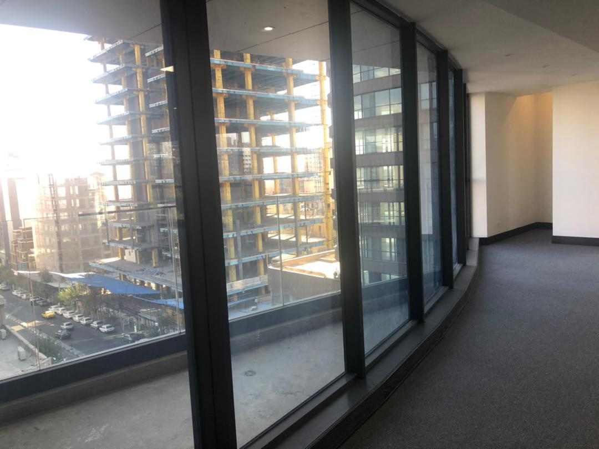
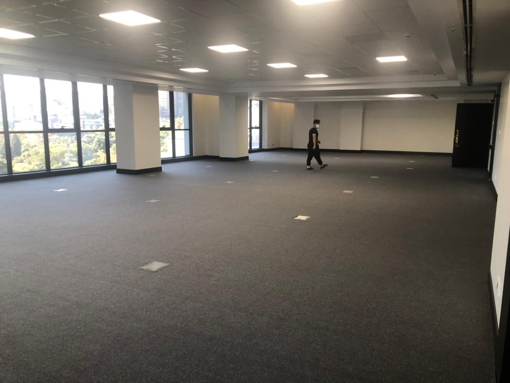
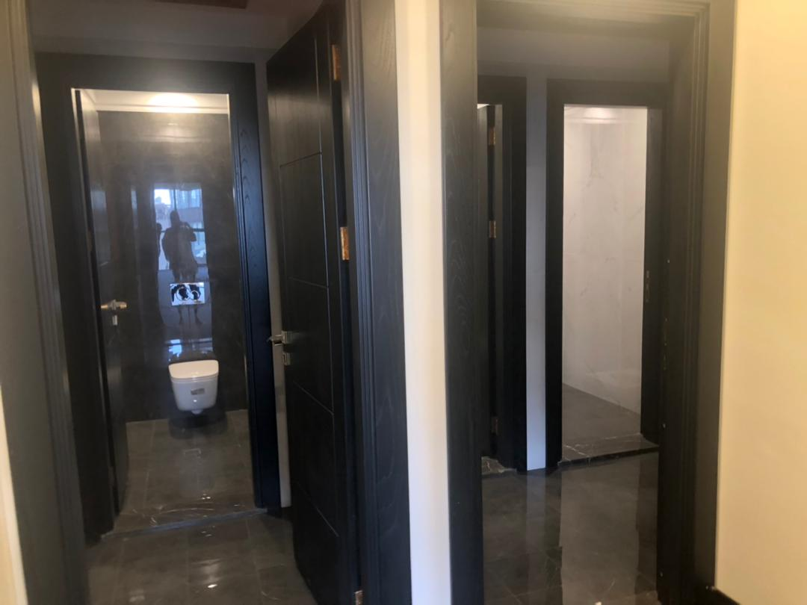
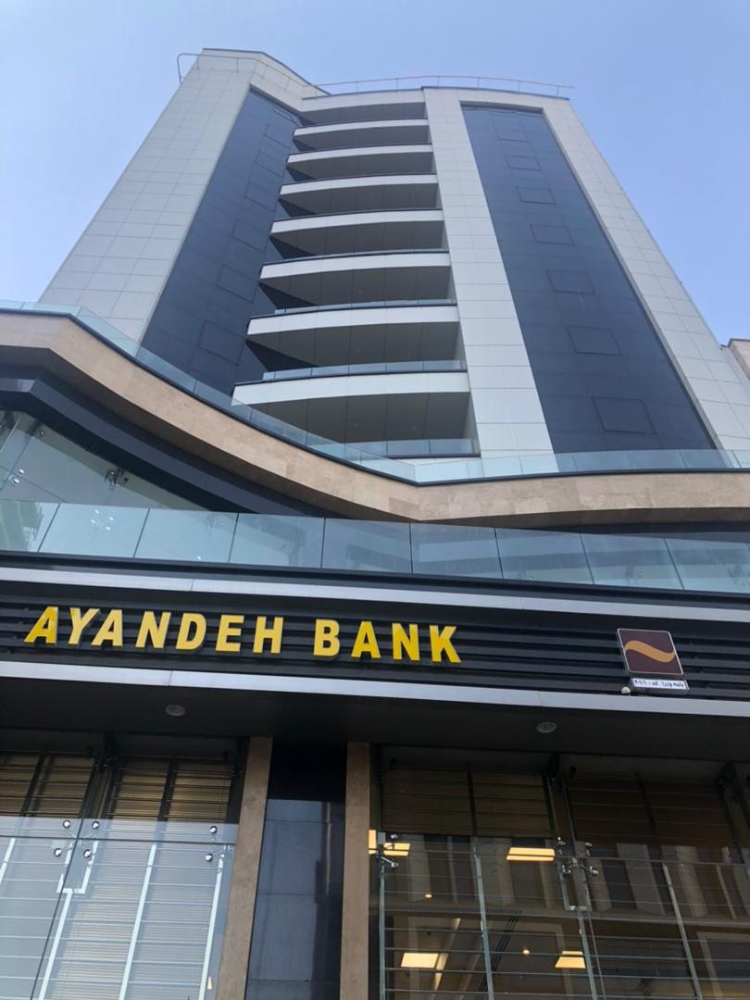

# Vozara
| **Office  nickname**                 | Vozara                                                                         |
| ---------------------------------------- | ------------------------------------------------------------------------------ |
| **Address**                          | Vozara - Ahmadian St.                                                          |
| **Google  maps  location  URL**      | [Link](https://goo.gl/maps/qvxZRZZvoC74Nhgz5) |
| **Size  in  Sq/m2**                  | 1552                                                                           |
| **Price  per  month:**               | $  35,925                                                                      |
| **Price  per  annum:**               | $  431,100                                                                     |
| **Quarterly traffic restriction certificate**     |   $ 55.5 per person (This certificate will issue quarterly by Tehran Municipality)  |
| **Quarterly traffic restriction certificate for 40 parking**     | Approximately  $ 2,220 |
| **Annum traffic restriction certificate**     | Approximately  $ 8,880   |
| **Running  cost  per  m2** |  N/A                                | 
| **Total  running  cost  per  month** | $  -                                                                          |
| **Total  running  cost  per  annum** | $  -                                                                          |
| **Floor  number**                    | Level 1-4                                                                      |
| **Parking**                          | 40                                                                             |
| **Agent  name**                      | Kani                                                                           |
| **Agent  Whatsapp  number**          | 09125150511                                                                    |
| **Agent  company**                   | Kani                                                                           |
| **Score**                            | 7                                 |
| **Score  reason**                    |  - Low renovation cost   - High security   - Near to taxi station and BRT           |
| **Comments  about  this  office**    |  - Seprated in 4 floors   - Located in traffic restrictioned areas   - Heavy traffic    |                                                                                                                   |

## Images

<video width="560" height="240" controls>
  <source src="./v1.mp4" type="video/mp4">
  Your browser does not support the video tag.
</video> 
<video width="560" height="240" controls>
  <source src="./v2.mp4" type="video/mp4">
  Your browser does not support the video tag.
</video> 

